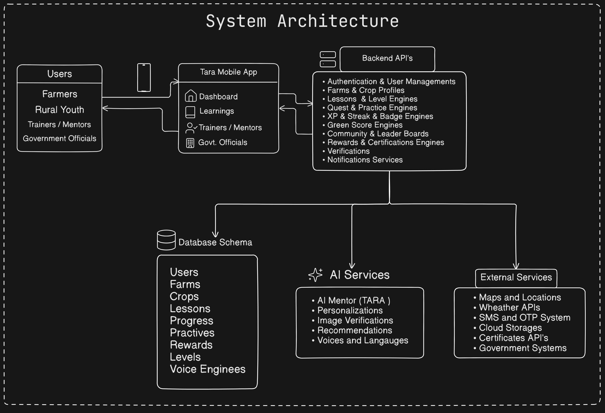
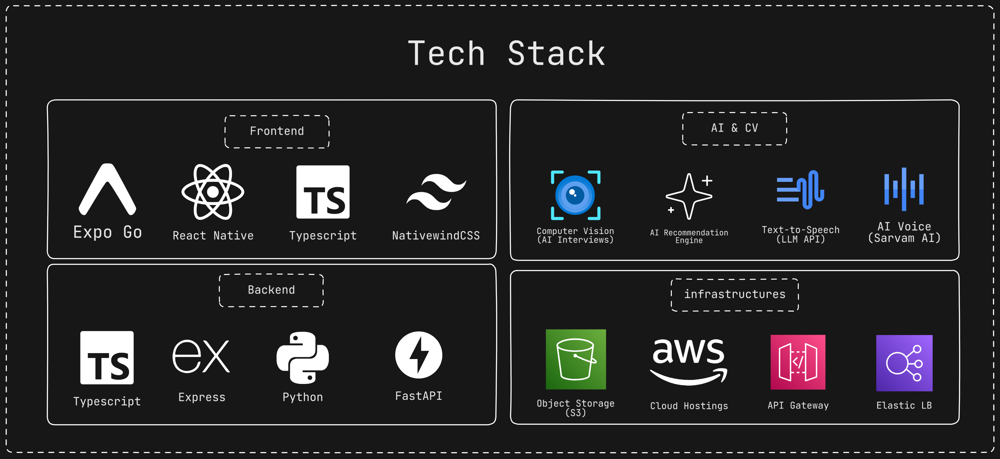
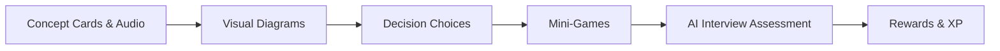
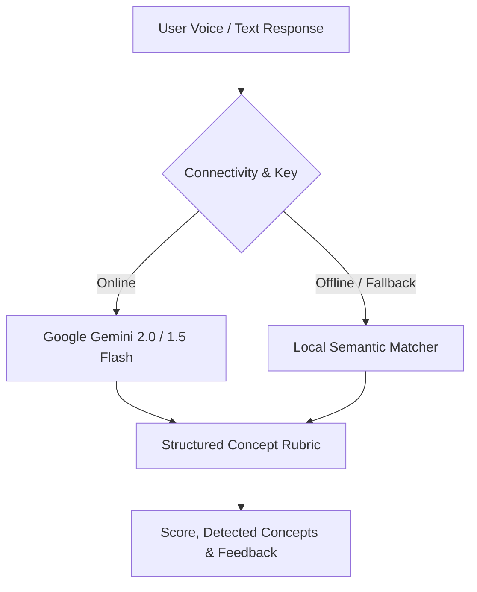
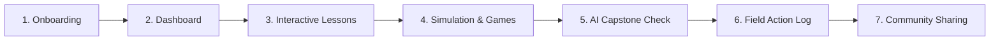
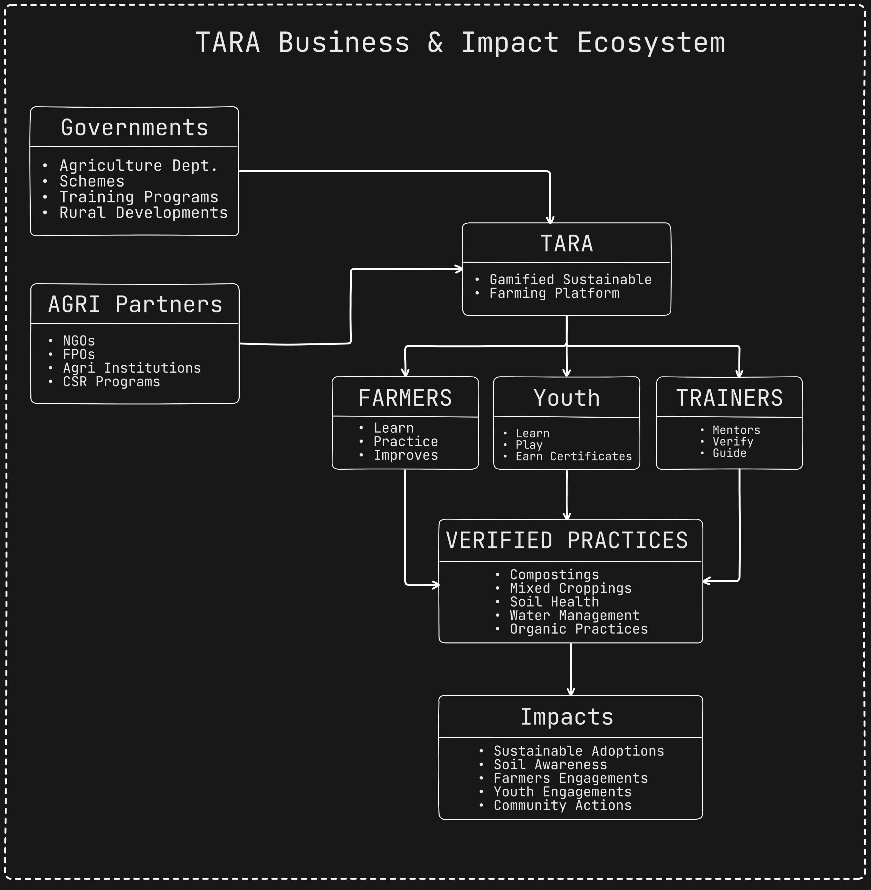

# TARA

## Gamified Platform to Promote Sustainable Farming Practices

**Submission for the BitnBuild Hackathon**

TARA is a mobile-first platform built with React Native and Expo that translates sustainable farming knowledge into verified field practices. Through interactive simulations, multilingual voice guidance, on-farm action logs, and AI capstone assessments, TARA enables farmers to adopt regenerative agriculture step-by-step.

---

## Pitch Presentation

<video src="README-docs/TARA-PITCH.mp4" controls="controls" width="100%" height="auto"></video>

- **Problem**: High failure rates transitioning to sustainable methods without structured guidance.
- **Solution**: Action-oriented learning path bridging conceptual understanding with verified field adoption.
- **Accessibility**: Multilingual voice support across English, Hindi, Telugu, and Malayalam.

---

## Prototype Walkthrough

<div align="center">
  <video src="README-docs/prototype-video.mp4" controls="controls" width="300"></video>
</div>

- **Onboarding**: Role selection (Farmer, Student, Agronomist), language, land size, and crops.
- **Dashboard**: Green Score tracking, daily targets, XP progression, and streaks.
- **Level Engine**: Soil cross-section exploration, decision choices, and mini-games.
- **AI Assessment**: Oral interview evaluation powered by Google Gemini with agronomic rubrics.
- **Community & Journey**: Regional voice stories, milestone logs, and peer leaderboards.

---

## The Problem

- **Passive Delivery**: Dense text and academic portals yield low retention among rural learners.
- **Action Disconnect**: Theoretical awareness rarely translates into correct field implementation.
- **Absence of Continuity**: Lack of ongoing milestones or feedback mechanisms following initial training.
- **Literacy Barriers**: Traditional extension materials often overlook voice-first regional requirements.

---

## System Architecture



- **Frontend Client**: Cross-platform mobile app built with React Native (0.86.2) and Expo SDK 57 (`expo-router`).
- **UI & Gestures**: Reanimated 4.5, Gesture Handler, Bottom Sheet, and React Native SVG.
- **State Management**: Modular React Context providers (`User`, `Learn`, `Progress`, `Community`, `FarmJourney`).
- **Data & Storage**: `expo-sqlite` and `expo-secure-store` for offline caching and encrypted token storage.
- **Audio & Media**: `expo-audio` and `expo-video` for native speech playback and video rendering.
- **AI Evaluation**: `GeminiAIInterviewService` with offline mock fallback.
- **Authentication**: Dual-mode adapter supporting local simulation or backend OAuth JWT.

---

## Technology Stack



| Layer | Technology | Purpose |
|---|---|---|
| Frontend | React Native 0.86, Expo SDK 57 | Cross-platform mobile client (Android / iOS) |
| Routing | Expo Router (v57) | File-based navigation and deep linking |
| Language | TypeScript 5.9 | Type safety and maintainability |
| UI & Motion | Reanimated 4.5, React Native SVG | Custom visual diagrams and animations |
| Audio & Media | Expo Audio, Expo Video | Multilingual narration and media streaming |
| AI Service | Google Gemini API (2.0 / 1.5 Flash) | Spoken assessment evaluation |
| Storage | Expo SQLite, Expo SecureStore | Offline caching and secure credential storage |
| Auth | Expo Auth Session, Google Sign-In | OAuth authentication lifecycle |

---

## The Solution

TARA structures learning into an action-oriented cycle:

1. **Understand**: Visual concept cards with synchronized native-language voice narration.
2. **Interact**: Hands-on diagrams and soil layer visualizers.
3. **Decide**: Branching scenario simulations featuring real farming trade-offs.
4. **Practice**: Step-by-step field checklists for on-farm implementation.
5. **Verify**: AI conversational evaluations and photo verification logs.
6. **Reinforce**: XP rewards, Green Score progression, and community recognition.

---

## Comparison

| Dimension | Traditional Extension | TARA Platform |
|---|---|---|
| Approach | Passive text and lectures | Interactive, scenario-driven modules |
| Personalization | Standardized curriculum | Tailored by crop, land size, and language |
| Engagement | Single-session delivery | Habit-forming streaks, levels, and badges |
| Usability | Text-heavy interfaces | Multilingual voice narration (EN, HI, TE, ML) |
| Verification | Untracked outcomes | Quantifiable Green Score and field practice logs |

---

## Target Users

- **Primary**: Smallholder farmers and farming families transitioning to regenerative practices.
- **Secondary**: Rural youth, agricultural students, and field extension volunteers.
- **Ecosystem Stakeholders (Future)**: Farmer Producer Organizations (FPOs) and agricultural NGOs.

---

## Core Features

- **Gamified Curriculum**: Progressive courses with interactive cards, visual diagrams, and mini-games.
- **Contextual Personalization**: Dynamic tracks based on role, land size, crops, and language.
- **TARA AI Evaluator**: Oral Q&A evaluated by Google Gemini against agronomic rubrics.
- **Practice Hub**: Field execution guides for mulching, composting, bio-fertilizers, and water conservation.
- **Gamification Engine**: XP, levels, streaks, daily goals, and unlockable achievement badges.
- **Green Score**: Composite metric quantifying user adoption of sustainable farming practices.
- **Community Layer**: Localized voice stories, contribution feeds, and regional leaderboards.
- **Offline Resilience**: Local SQLite caching and bundled audio for low-connectivity environments.

---

## Learning Structure



- **Concepts**: Bite-sized principles paired with native audio narration.
- **Exploration**: Interactive soil horizon and root-depth visualizers.
- **Decisions**: Real-world scenarios (e.g., moisture stress, pest outbreaks).
- **Mini-Games**: Drag-and-drop matching, category sorting, and memory reinforcement.
- **AI Assessment**: Spoken concept evaluation prior to unlocking subsequent levels.

---

## Personalization & Localization

- **Languages**: English, Hindi, Telugu, and Malayalam across UI, audio, and AI prompts.
- **Farm Parameters**: Modules filtered by land holding size, soil type, and active crops.
- **Adaptive Progression**: Level unlocks adjust based on quiz accuracy and logged practices.

---

## AI Architecture



- **Provider**: Google Gemini REST API (`gemini-2.0-flash` / `gemini-1.5-flash`).
- **Response Format**: JSON schema returning score (`0-100`), pass status, detected concepts, and feedback.
- **Offline Fallback**: Embedded keyword and concept matcher functions when offline or without an API key.

---

## Gamification & Practice Tracking

- **XP & Streaks**: Immediate rewards supporting consistent daily engagement.
- **Green Score**: Aggregate index measuring sustainable practice adoption.
- **Milestone Map**: Visual roadmap of unlocked and completed curriculum nodes.
- **Field Practice Log**: Photo capture and checklist to document on-farm execution.
- **Competency Radar**: Radar visualization tracking balance across Soil, Water, Pest, and Crop management.

---

## User Flow



1. **Onboard**: Select language, user role, farm location, land size, and crops.
2. **Dashboard**: Review daily goals, active streak, and current Green Score.
3. **Learn**: Complete structured lesson levels with voice guidance.
4. **Simulate**: Solve interactive decision scenarios and mini-games.
5. **Evaluate**: Complete the AI oral capstone assessment.
6. **Apply**: Implement field practice tasks and record photo logs.
7. **Share**: Post milestone updates and listen to community voice stories.

---

## Data Schema

| Entity | Description |
|---|---|
| User & Farm Profile | Role, language, location, land size, primary crops, soil type |
| Lesson & Level | Course tracks and interactive phases (learn, quiz, game, interview) |
| Progress & XP | Completed levels, active streak count, milestone states |
| Green Score | Composite sustainability metrics across soil, water, and inputs |
| Farm Practice | Field action records, photo checkpoints, and category tags |
| Community | Peer voice stories, contribution feeds, and leaderboards |

---

## API Summary

- `POST /api/auth/google`: OAuth authentication and token issuance.
- `GET /api/users/me` & `PUT /api/users/me/preferences`: User profile and preference synchronization.
- `GET /api/learn/lessons`: Module catalog and level hierarchy.
- `POST /api/learn/levels/:levelId/complete`: Record completion and update XP / Green Score.
- `POST /api/ai/evaluate-interview`: Send spoken responses for structured AI evaluation.
- `GET/POST /api/community/stories`: Read and publish peer voice stories.

---

## Security & Configuration

- **Secure Storage**: Credentials stored via `expo-secure-store` using hardware-backed keystores.
- **Environment Isolation**: Public configuration (`EXPO_PUBLIC_*`) separated from private secrets.
- **AI Sanitization**: Prompts exclude PII; responses are validated against strict JSON schemas.

---

## Business Model & Sustainability



### Potential Strategic Models *(Product Vision)*
- **B2G (Public Extension Programs)**: Deployment through government agricultural and soil health missions.
- **B2B / Institutional**: Partnerships with FPOs, agribusinesses, and CSR foundations for sustainable sourcing.
- **Value-Added Services**: Advanced cohort analytics and customized institutional training dashboards.

---

## Potential Impact

| Metric | Target Outcome |
|---|---|
| Module Completion Rate | High retention of core sustainable farming concepts |
| Verified Field Practices | Measurable on-farm adoption of regenerative practices |
| Green Score Growth | Aggregate improvement in ecological farming practices |
| Voice Story Sharing | Peer-driven knowledge transfer across farming clusters |

---

## Scalability & Future Scope

### Scalability
- **JSON Schemas**: Add new crops and agronomic modules without app redeployment.
- **Offline Architecture**: Minimizes backend load in bandwidth-constrained environments.

### Future Roadmap
- **Additional Languages**: Support for Tamil, Kannada, Marathi, and Bengali.
- **Computer Vision Verification**: On-device image verification for mulching and compost stages.
- **Hyperlocal Weather Alerts**: Practice recommendations tied to local micro-climate forecasts.
- **Soil Sensor Integration**: Direct sync with digital soil testing kits.

---

## Project Structure

```
Tara/
├── docs/Readme-docs/        # Pitch & prototype videos, architecture & tech stack images
├── src/
│   ├── app/                 # Expo Router screens (tabs, learn, community, profile)
│   ├── auth/                # Dual-mode authentication (local simulation & backend OAuth)
│   ├── components/          # UI components (learn engine, progress, practice)
│   ├── context/             # State providers (User, Learn, Progress, Community)
│   ├── data/                # Lesson schemas, audio definitions, and datasets
│   ├── hooks/               # Custom hooks (audio, translation, updates)
│   ├── services/            # Repositories, SQLite sync, and Gemini AI service
│   ├── storage/             # Secure store adapters and local cache
│   └── theme/               # Colors, typography, and styling tokens
├── app.json                 # Expo application manifest
└── package.json             # Scripts and dependencies
```

---

## Getting Started

### Prerequisites
- Node.js `v18+` or `v20+`
- Expo Go app on a mobile device OR Android Emulator / iOS Simulator

### Quickstart

```bash
# 1. Clone repository
git clone https://github.com/lokeshkonka/tara-app.git
cd tara-app/Tara

# 2. Install dependencies
npm install

# 3. Configure environment variables
cp .env.example .env

# 4. Start the application
npx expo start
```

### Environment Variables (`.env`)

```env
EXPO_PUBLIC_AUTH_MODE=local
EXPO_PUBLIC_API_BASE_URL=
EXPO_PUBLIC_GOOGLE_CLIENT_ID=
EXPO_PUBLIC_GEMINI_API_KEY=your_gemini_key_here
```

---

## Demo Assets

- **TARA Pitch Video**: `README-docs/TARA-PITCH.mp4`
- **Prototype Walkthrough**: `README-docs/prototype-video.mp4`
- **System Architecture**: `README-docs/system-architecture.png`
- **Technology Stack**: `README-docs/tech-stack.png`
- **Business & Impact Model**: `README-docs/business-impacts.png`

---

## BitnBuild Hackathon

- **Project**: TARA — Gamified Platform to Promote Sustainable Farming Practices
- **Domain**: Sustainable Agriculture, Rural Digital Literacy & Behavior Change
- **Core Innovation**: Multilingual voice-guided gamification with AI conversational assessment and verified field practice tracking.

---

## License

This project is licensed under the [MIT License](LICENSE).
