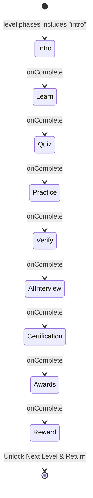

# TARA Learn Module — Implementation Plan

## 1. Executive Summary

The **TARA Learn Module** is designed as a fully data-driven, reusable learning engine following the **Single Responsibility Principle** and the core architectural law:
> **"Components define HOW the experience works. Data defines WHAT the learner experiences."**

The learner progresses smoothly across the structured hierarchy:
$$\text{Lessons List} \longrightarrow \text{Lesson Detail} \longrightarrow \text{Level Timeline} \longrightarrow \text{Dedicated Level Experience} \longrightarrow \text{Phase Engine} \longrightarrow \text{Completion \& Progression}$$

The architecture separates lesson definitions, level phase definitions, user progress persistence, and service adapters (voice, CV, AI interview, certification, awards). Adding a new lesson or level requires **zero new React screens or UI components**—only a TypeScript data definition registered in the central registry.

---

## 2. Existing Project Analysis

| Aspect | Current Workspace State |
| :--- | :--- |
| **Framework & Engine** | Expo SDK 57 (`expo ~57.0.13`), React 19 (`19.2.3`), React Native 0.86 (`0.86.2`), Expo Router v57 (`expo-router ~57.0.13`). |
| **Styling & Theming** | Design token system in `src/theme/theme.ts` adhering to Material 3 + Soft-Tactile refinements from `docs/DESIGN.md`. |
| **Navigation & Tabs** | Expo Router file-based routing. Tab navigator in `src/app/(tabs)/` with custom 3D tactile pill tab bar in `_layout.tsx`. Current tabs: `index` (Home), `learn` (Learnings), `practice`, `community`, `profile`. |
| **State Management** | Context API layered hierarchy in `src/context/` (`AppContext`, `LearnContext`, `UserContext`, `OnboardingContext`, `ProgressContext`, `DashboardContext`). |
| **Data Layer** | Repository pattern abstraction (`ILearnRepository`, `IUserRepository`, etc.) in `src/services/repositories/` with environment-switched dummy repositories in `src/services/dummy/` and future API adapters. |
| **Character Integration** | Full `Tara` mentor component in `src/components/Tara/Tara.tsx` with animated speech bubbles, voice playback (`expo-audio`), 10 expressions, audio pulse ring, and multilingual support. |
| **Assets Available** | High-res category artwork in `assets/Learn-Assets/` (`soil-health.png`, `water.png`, `compost.png`, `pest-control.png`, `crop.png`), Plus Jakarta Sans typography, Tara expression portraits. |

---

## 3. DESIGN.md Analysis & Visual Conventions

All planned UI strictly complies with `docs/DESIGN.md` tokens and conventions:

- **Color Palette**:
  - `primaryContainer`: `#4CAF50` (Vibrant Green growth actions)
  - `onPrimaryFixedVariant`: `#005313` (3D button edge)
  - `surface`: `#F7FAF5` (Soft off-white background)
  - `surfaceContainerLowest`: `#FFFFFF` (Card surfaces)
  - `tertiaryContainer`: `#CDA721` / `#FFD54F` (Warm yellow rewards, XP badges)
  - `componentColors.cardBorder` (`#BECAB9`) & `componentColors.cardEdge` (`#C7CFC6`) (Soft 3D card elevation)
- **Soft 3D Tactile Buttons (`TactileButton`)**:
  - `3px` bottom border edge for depth, tactile spring squish on press (`translateY(3px)` with `scale(0.98)`).
- **Typography (`Plus Jakarta Sans`)**:
  - `headlineLg` (30px Bold), `headlineMd` (20px SemiBold), `bodyLg` (18px Regular), `bodyMd` (16px Regular), `labelLg` (14px SemiBold), `labelSm` (12px Medium).
- **Progress Indicators**:
  - Continuous `12px` height bar with rounded pill caps (`rounded.full`), track `#ECEFEA`, fill vibrant `#4CAF50` / reward `#CDA721`.
- **Character Integration**:
  - Tara mentor visual presence with dialogue bubble and talking pulse ring (`1200ms` loop) at checkpoints and feedback cycles.

---

## 4. Existing Components Audit

| Component | Path | Current Functionality |
| :--- | :--- | :--- |
| `LearnHeader` | `src/components/learn/LearnHeader.tsx` | Displays streak days and today's XP pill banner. |
| `LearnCategories` | `src/components/learn/LearnCategories.tsx` | Horizontal pill selector for category filtering. |
| `LearnSearchFilter` | `src/components/learn/LearnSearchFilter.tsx` | Search bar with search input and filter toggle. |
| `LessonCard` | `src/components/learn/LessonCard.tsx` | Visual card with hero artwork, category chip, level badge, XP pill, title, description, and tactile button. |
| `LearnEmptyState` | `src/components/learn/LearnEmptyState.tsx` | Empty state when category lessons are being prepared. |
| `Tara` | `src/components/Tara/Tara.tsx` | Character avatar with animated dialogue bubble, audio playback, expression fades, and pulse ring. |
| `TactileButton` | `src/components/ui/TactileButton.tsx` | 3D tactile squishy press button. |
| `ProgressBar` | `src/components/ui/ProgressBar.tsx` | Reusable animated progress bar. |

---

## 5. Components to Reuse

1. **`TactileButton`** (`src/components/ui/TactileButton.tsx`): Primary action buttons throughout Lesson Detail, Phase Navigation, MCQ Submissions, and Reward claims.
2. **`ProgressBar`** (`src/components/ui/ProgressBar.tsx`): Header progress and scene progress across all phases.
3. **`Tara`** (`src/components/Tara/Tara.tsx`): Base character sprite and expression controller.
4. **`BadgeChip`** (`src/components/ui/BadgeChip.tsx`): Category and tag pills.
5. **`AtmosphericGlow`** (`src/components/ui/AtmosphericGlow.tsx`): Visual delight background for reward and completion celebrations.

---

## 6. Components to Refactor

1. **`src/types/learn.ts`**:
   - Refactor from flat single-lesson definitions into a rich hierarchical system (`LearnLessonDefinition`, `LearnLevelDefinition`, `LearnPhaseDefinition`, `UserLearnProgress`).
2. **`src/components/learn/LessonCard.tsx`**:
   - Update `onPress` to trigger route navigation to `/learn/lessons/[lessonId]` (Lesson Detail screen) rather than directly completing the lesson.
3. **`src/context/LearnContext.tsx`**:
   - Extend state to manage active lesson detail, level phase progression, and persistent level checkpoints.

---

## 7. New Components to Create

### A. Tara System
- **`TaraParagraph`** (`src/components/Tara/TaraParagraph.tsx`): Composed mentor display combining `Tara` avatar, speech bubble, dynamic voice triggers, typing effect, and optional context action.

### B. Lesson Detail & Timeline
- **`LessonDetailHeader`** (`src/components/learn/detail/LessonDetailHeader.tsx`): Hero section with category, title, metadata pills (time, levels, total XP), back button.
- **`LessonOverview`** (`src/components/learn/detail/LessonOverview.tsx`): Summary cards displaying "Why It Matters" and "What You'll Learn" bullet points.
- **`LessonProgressSummary`** (`src/components/learn/detail/LessonProgressSummary.tsx`): Visual percentage bar and completed/in-progress/locked metrics.
- **`LessonTimeline`** (`src/components/learn/detail/LessonTimeline.tsx`): Soft-tactile vertical journey path connecting level nodes.
- **`LevelNode`** (`src/components/learn/detail/LevelNode.tsx`): Interactive Candy-Crush-inspired tactile level bubble supporting 4 states: `completed`, `inProgress`, `available`, and `locked`.

### C. Dedicated Level Experience Engine
- **`LevelHeader`** (`src/components/learn/level/LevelHeader.tsx`): Top bar with exit button, level title, phase progress bar, and active XP counter.
- **`LevelRenderer`** (`src/components/learn/level/LevelRenderer.tsx`): Dynamic phase dispatcher rendering the active phase component from phase configuration.
- **`LevelExitModal`** (`src/components/learn/level/LevelExitModal.tsx`): Checkpoint confirmation dialog ("Leave this level? Your progress will be saved.").

### D. Phase Renderers
- **`LevelIntroPhase`** (`src/components/learn/phases/LevelIntroPhase.tsx`): Level introduction card with mentor guidance.
- **`LearnStoryPhase`** (`src/components/learn/phases/LearnStoryPhase.tsx`): Scene-by-scene interactive story cards with images, body text, and audio narrative.
- **`QuizPhase`** (`src/components/learn/phases/QuizPhase.tsx`): MCQ questionnaire engine with immediate Tara feedback and score tabulation.
- **`PracticePhase`** (`src/components/learn/phases/PracticePhase.tsx`): Mini-game activity dispatcher (Match, Sort, Memory).
- **`VerifyPhase`** (`src/components/learn/phases/VerifyPhase.tsx`): Camera/evidence verification workflow with CV processing state.
- **`AIInterviewPhase`** (`src/components/learn/phases/AIInterviewPhase.tsx`): Oral/written conversational question checkpoint with real-time concept feedback.
- **`CertificationPhase`** (`src/components/learn/phases/CertificationPhase.tsx`): Verifiable credential preview with QR code and authority metadata.
- **`AwardsPhase`** (`src/components/learn/phases/AwardsPhase.tsx`): Unlock animation for badges, milestones, and sustainable farming achievements.
- **`RewardPhase`** (`src/components/learn/phases/RewardPhase.tsx`): Level completion celebration screen displaying earned XP, unlocked rewards, and CTA to next level.

### E. Practice Activities & Verification Components
- **`MatchActivity`** (`src/components/learn/practice/MatchActivity.tsx`): Interactive two-column tap-to-pair activity.
- **`SortActivity`** (`src/components/learn/practice/SortActivity.tsx`): Interactive classification bucket drag/tap activity.
- **`MemoryActivity`** (`src/components/learn/practice/MemoryActivity.tsx`): Tile-matching card pairs activity.
- **`VerificationCamera`** (`src/components/learn/verification/VerificationCamera.tsx`): Camera capture interface with framing reticle and lighting tips.
- **`VerificationResult`** (`src/components/learn/verification/VerificationResult.tsx`): Analysis outcome card with Tara feedback and retry options.

---

## 8. High-Level Architecture

```mermaid
flowchart TD
    subgraph Data Layer
        LR[Lesson Registry] --> SB[Soil Basics Definition]
        LR --> WB[Water Basics Definition]
        LR --> PC[Pest Control Definition]
        SB --> L1[Level 1: Intro, Learn, Quiz, Practice, Verify, Reward]
        SB --> L2[Level 2: Intro, Learn, Quiz, Practice, Reward]
        SB --> L3[Level 3: Intro, Learn, Quiz, Practice, AIInterview, Cert, Reward]
    end

    subgraph Service Layer
        VS[Voice Service]
        PS[Progress Service / SecureStore]
        CVS[CV Verification Service]
        AIS[AI Interview Service]
        CS[Certification Service]
        AS[Awards Service]
    end

    subgraph Presentation Engine
        LC[LearnTab Screen] --> LD[LessonDetail Screen]
        LD --> LT[LessonTimeline]
        LT --> LN[LevelNode]
        LN --> LP[LevelPage Screen]
        LP --> LRend[LevelRenderer]
        LRend --> P1[LevelIntroPhase]
        LRend --> P2[LearnStoryPhase]
        LRend --> P3[QuizPhase]
        LRend --> P4[PracticePhase]
        LRend --> P5[VerifyPhase]
        LRend --> P6[AIInterviewPhase]
        LRend --> P7[CertificationPhase]
        LRend --> P8[AwardsPhase]
        LRend --> P9[RewardPhase]
    end

    Data Layer --> Presentation Engine
    Service Layer <--> Presentation Engine
```

---

## 9. Data Models (`src/types/learn.ts`)

```typescript
import type { TaraExpression } from "../components/Tara/Tara.types";

export type PhaseType =
  | "intro"
  | "learn"
  | "quiz"
  | "practice"
  | "verify"
  | "aiInterview"
  | "certification"
  | "awards"
  | "reward";

export interface TaraDialogueSnippet {
  expression: TaraExpression;
  textKey: string;
  voiceId?: string;
}

export interface LearnSceneDefinition {
  id: string;
  titleKey: string;
  bodyKey: string;
  image?: any;
  tara?: TaraDialogueSnippet;
}

export interface MCQOptionDefinition {
  id: string;
  textKey: string;
  isCorrect: boolean;
}

export interface MCQQuestionDefinition {
  id: string;
  questionKey: string;
  options: MCQOptionDefinition[];
  explanationKey: string;
  taraFeedback: {
    correctKey: string;
    incorrectKey: string;
  };
}

export type PracticeActivityType = "match" | "sort" | "memory";

export interface MatchPairDefinition {
  id: string;
  leftTextKey: string;
  rightTextKey: string;
}

export interface SortCategoryDefinition {
  id: string;
  titleKey: string;
}

export interface SortItemDefinition {
  id: string;
  textKey: string;
  targetCategoryId: string;
}

export interface PracticeActivityDefinition {
  id: string;
  type: PracticeActivityType;
  titleKey: string;
  instructionsKey: string;
  matchData?: { pairs: MatchPairDefinition[] };
  sortData?: { categories: SortCategoryDefinition[]; items: SortItemDefinition[] };
  memoryData?: { pairs: { id: string; labelKey: string; icon: string }[] };
}

export interface VerificationConfigDefinition {
  type: "soil_photo" | "leaf_photo" | "water_setup" | "observation";
  titleKey: string;
  instructions: string[];
  cvConfig: {
    requiresSoilDetection?: boolean;
    rejectBlurredImages?: boolean;
    detectFaces?: boolean;
    minimumQuality?: number;
  };
}

export interface AIInterviewConfigDefinition {
  id: string;
  titleKey: string;
  questions: {
    id: string;
    questionKey: string;
    expectedConcepts: string[];
    followUpKey?: string;
  }[];
  passingScore: number;
}

export interface CertificateConfigDefinition {
  id: string;
  titleKey: string;
  authorityName: string;
  authorityLogo?: string;
  skills: string[];
  isGovernmentApproved: boolean;
}

export interface AwardConfigDefinition {
  id: string;
  titleKey: string;
  descriptionKey: string;
  icon: string;
  tier: "bronze" | "silver" | "gold";
}

export interface LearnLevelDefinition {
  id: string;
  level: number;
  titleKey: string;
  descriptionKey: string;
  durationMinutes: number;
  xp: number;
  phases: PhaseType[];
  intro?: {
    expression: TaraExpression;
    dialogue: string[];
    voiceId?: string;
  };
  learn?: {
    scenes: LearnSceneDefinition[];
  };
  quiz?: {
    questions: MCQQuestionDefinition[];
  };
  practice?: PracticeActivityDefinition[];
  verification?: VerificationConfigDefinition;
  aiInterview?: AIInterviewConfigDefinition;
  certification?: CertificateConfigDefinition;
  awards?: AwardConfigDefinition[];
  reward: {
    xp: number;
    badge?: {
      id: string;
      titleKey: string;
      descriptionKey: string;
      icon: string;
    };
  };
}

export interface LearnLessonDefinition {
  id: string;
  categoryId: string;
  titleKey: string;
  descriptionKey: string;
  icon: string;
  totalDurationMinutes: number;
  totalXp: number;
  whyItMattersKey: string;
  learningOutcomes: string[];
  levels: LearnLevelDefinition[];
}

export interface UserLearnProgress {
  lessonId: string;
  completedLevels: string[];
  currentLevelId: string;
  levelProgress: Record<string, number>; // 0 to 1
  levelPhaseIndex: Record<string, number>; // checkpoint within level
  totalXpEarned: number;
  unlockedLevels: string[];
  verifiedPractices: string[];
  certificatesEarned: string[];
  awardsEarned: string[];
}
```

---

## 10. Lesson & Level Architecture

### Lesson Definition Structure
Each lesson file in `src/data/lessons/` (e.g., `soilBasics.ts`, `smartWatering.ts`, `pestControl.ts`) exports a strongly-typed `LearnLessonDefinition`.

```text
src/data/lessons/
├── soilBasics.ts        (Soil Health: 3 Levels)
├── smartWatering.ts     (Water Management: 3 Levels)
├── pestControl.ts       (Natural Pest Control: 3 Levels)
└── lessonRegistry.ts    (Exports LESSON_REGISTRY array and lookup helpers)
```

Adding a new topic such as **Composting Basics** requires only adding `compostingBasics.ts` and adding it to `LESSON_REGISTRY`.

---

## 11. Reusable Level Phase Pipeline

The Level engine runs as a sequential, data-driven finite state machine:

$$\text{Phase: } 0 \to 1 \to \dots \to N - 1$$



---

## 12. Service Architecture & Backend Readiness

```text
src/services/
├── repositories/
│   ├── ILearnRepository.ts
│   └── IProgressRepository.ts
├── voice/
│   └── voiceService.ts          (Resolves audio asset or TTS endpoint)
├── cv/
│   ├── ICVVerificationService.ts
│   ├── MockCVService.ts         (Validates image dimensions/quality mock)
│   └── RealCVService.ts         (Backend endpoint adapter)
├── aiInterview/
│   ├── IAIInterviewService.ts
│   ├── MockAIInterviewService.ts(Simulates real-time response analysis)
│   └── RealAIInterviewService.ts(Future LLM endpoint)
└── certification/
    └── certificateService.ts    (Issues digital signature & QR payload)
```

---

## 13. Routing Architecture (Expo Router v57)

File-based route structure in `src/app/`:

```text
src/app/
├── (tabs)/
│   └── learn.tsx                              (/learn - Lessons catalogue)
├── learn/
│   ├── lessons/
│   │   └── [lessonId]/
│   │       ├── index.tsx                      (/learn/lessons/:lessonId - Detail & Timeline)
│   │       └── levels/
│   │           └── [levelId].tsx              (/learn/lessons/:lessonId/levels/:levelId - Dedicated Engine)
```

No hardcoded per-lesson routes exist. The dynamic route `[lessonId]/index.tsx` loads any lesson by ID, and `[levelId].tsx` runs any level.

---

## 14. File-by-File Change Plan

| File Path | Action | Purpose | Priority |
| :--- | :--- | :--- | :--- |
| `src/types/learn.ts` | **MODIFY** | Comprehensive data contracts for lessons, levels, phases, and user progress | P0 |
| `src/data/lessons/soilBasics.ts` | **CREATE** | Full Level 1, 2, 3 definition for Soil Basics with stories, quizzes, activities | P0 |
| `src/data/lessons/smartWatering.ts` | **CREATE** | Multi-level lesson definition for Smart Water Management | P0 |
| `src/data/lessons/pestControl.ts` | **CREATE** | Multi-level lesson definition for Natural Pest Control | P0 |
| `src/data/lessons/lessonRegistry.ts` | **CREATE** | Central registry and lookup utilities (`getLessonById`, `getLevelById`) | P0 |
| `src/services/repositories/ILearnRepository.ts` | **MODIFY** | Extended repository contract with level-specific progress endpoints | P0 |
| `src/services/dummy/DummyLearnRepository.ts` | **MODIFY** | Mock implementation supporting progress persistence and level updates | P0 |
| `src/services/cv/ICVVerificationService.ts` | **CREATE** | Service interface for computer vision field checks | P1 |
| `src/services/cv/MockCVService.ts` | **CREATE** | Local CV verification simulator with delay and confidence scoring | P1 |
| `src/services/aiInterview/IAIInterviewService.ts` | **CREATE** | Interface for oral/written concept analysis | P1 |
| `src/services/aiInterview/MockAIInterviewService.ts`| **CREATE**| Concept extraction and adaptive scoring simulator | P1 |
| `src/services/certification/certificateService.ts`| **CREATE**| Verifiable certificate generator and QR payload formatter | P1 |
| `src/components/Tara/TaraParagraph.tsx` | **CREATE** | Reusable mentor paragraph with speech bubble, expression, and voice | P0 |
| `src/components/learn/detail/LessonDetailHeader.tsx`| **CREATE**| Hero header with category tag, title, XP, duration, and back button | P0 |
| `src/components/learn/detail/LessonOverview.tsx`| **CREATE** | "Why It Matters" card and "What You'll Learn" checklist | P0 |
| `src/components/learn/detail/LessonProgressSummary.tsx`| **CREATE**| Percentage progress and completed/in-progress/locked breakdown | P0 |
| `src/components/learn/detail/LevelNode.tsx` | **CREATE** | Candy-Crush-inspired 3D tactile level journey node | P0 |
| `src/components/learn/detail/LessonTimeline.tsx` | **CREATE** | Journey path connecting LevelNodes with vertical curved layout | P0 |
| `src/components/learn/level/LevelHeader.tsx` | **CREATE** | Dedicated top bar with phase progress bar and active XP badge | P0 |
| `src/components/learn/level/LevelRenderer.tsx` | **CREATE** | Dynamic phase dispatcher rendering active phase | P0 |
| `src/components/learn/level/LevelExitModal.tsx` | **CREATE** | Checkpoint exit confirmation modal | P0 |
| `src/components/learn/phases/LevelIntroPhase.tsx` | **CREATE** | Reusable Phase 1 intro card with Tara guidance | P0 |
| `src/components/learn/phases/LearnStoryPhase.tsx` | **CREATE** | Reusable Phase 2 interactive scene story engine | P0 |
| `src/components/learn/phases/QuizPhase.tsx` | **CREATE** | Reusable Phase 3 MCQ engine with immediate feedback | P0 |
| `src/components/learn/phases/PracticePhase.tsx` | **CREATE** | Reusable Phase 4 mini-game dispatcher | P0 |
| `src/components/learn/phases/VerifyPhase.tsx` | **CREATE** | Reusable Phase 5 camera verification flow | P1 |
| `src/components/learn/phases/AIInterviewPhase.tsx` | **CREATE** | Reusable Phase 6 conversational concept check | P1 |
| `src/components/learn/phases/CertificationPhase.tsx`| **CREATE**| Reusable Phase 7 credential display | P1 |
| `src/components/learn/phases/AwardsPhase.tsx` | **CREATE** | Reusable Phase 8 award/badge unlocked celebration | P1 |
| `src/components/learn/phases/RewardPhase.tsx` | **CREATE** | Reusable Phase 9 level completion reward screen | P0 |
| `src/components/learn/practice/MatchActivity.tsx` | **CREATE** | Tap-to-match pair activity | P0 |
| `src/components/learn/practice/SortActivity.tsx` | **CREATE** | Category sorting bucket activity | P0 |
| `src/components/learn/practice/MemoryActivity.tsx` | **CREATE** | Tile-matching memory activity | P1 |
| `src/components/learn/verification/VerificationCamera.tsx`| **CREATE**| Camera viewfinder with overlay reticle | P1 |
| `src/components/learn/verification/VerificationResult.tsx`| **CREATE**| CV analysis result card with retry/proceed buttons | P1 |
| `src/app/learn/lessons/[lessonId]/index.tsx` | **CREATE** | Lesson Detail & Timeline screen route | P0 |
| `src/app/learn/lessons/[lessonId]/levels/[levelId].tsx`| **CREATE**| Dedicated Level Experience screen route | P0 |
| `src/components/learn/LessonCard.tsx` | **MODIFY** | Navigate to `/learn/lessons/${lesson.id}` on card press | P0 |
| `src/i18n/index.ts` | **MODIFY** | Add lesson/level strings, dialogue, quiz questions, and feedback keys | P0 |

---

## 15. Documentation Structure (`docs/learn/`)

Every reusable module will have clear technical documentation:

```text
docs/learn/
├── README.md
├── architecture/
│   ├── overview.md
│   ├── data-flow.md
│   ├── routing.md
│   └── progress-model.md
├── tara/
│   └── tara-paragraph.md
├── lessons/
│   ├── lesson-detail.md
│   ├── lesson-timeline.md
│   └── level-node.md
├── phases/
│   ├── intro.md
│   ├── learn.md
│   ├── quiz.md
│   ├── practice.md
│   ├── verify.md
│   ├── ai-interview.md
│   ├── certification.md
│   └── reward.md
└── practice/
    ├── match.md
    └── sort.md
```

---

## 16. Step-by-Step Implementation Sequence

```text
FLOW 1: Core Foundation & Data Types
  ├── Refactor src/types/learn.ts
  ├── Create lesson data (soilBasics.ts, smartWatering.ts, pestControl.ts)
  ├── Create lessonRegistry.ts
  └── Update ILearnRepository and DummyLearnRepository

FLOW 2: TaraParagraph Mentor Component
  ├── Implement TaraParagraph.tsx
  └── Verify expression fades, speech bubbles, and voice playback

FLOW 3: Lesson Detail & Level Timeline
  ├── Create LessonDetailHeader, LessonOverview, LessonProgressSummary
  ├── Create LevelNode and LessonTimeline
  ├── Create route src/app/learn/lessons/[lessonId]/index.tsx
  └── Update LessonCard.tsx to navigate to Lesson Detail

FLOW 4: Dedicated Level Experience & Core Phases
  ├── Create LevelHeader, LevelExitModal, LevelRenderer
  ├── Implement LevelIntroPhase, LearnStoryPhase, QuizPhase, RewardPhase
  └── Create route src/app/learn/lessons/[lessonId]/levels/[levelId].tsx

FLOW 5: Practice Activities Engine
  ├── Implement MatchActivity
  ├── Implement SortActivity
  ├── Implement MemoryActivity
  └── Integrate into PracticePhase

FLOW 6: Verification, AI Interview & Certification
  ├── Implement VerificationCamera, MockCVService, VerifyPhase
  ├── Implement MockAIInterviewService, AIInterviewPhase
  └── Implement CertificationPhase, AwardsPhase

FLOW 7: Progress Persistence & Multi-lesson Verification
  ├── Connect progress updating to SecureStore / Context
  ├── Add multilingual translation strings in src/i18n/index.ts
  └── Test Soil Basics, Smart Watering, and Pest Control across all phases
```

---

## 17. Verification & Testing Plan

### Automated Verification
- Run TypeScript type checks (`npx tsc --noEmit`) to verify strict contract safety across all lessons and phases.
- Run ESLint (`npm run lint`).

### Manual Verification Flow
1. **Lessons List**: Open the Learn tab, verify active and completed lesson cards with correct badges and XP.
2. **Lesson Detail**: Tap "Soil Basics" card $\to$ Navigate to `/learn/lessons/soil-basics`.
   - Verify "Why It Matters", "What You'll Learn", and Level Timeline.
   - Verify Level 1 is available/completed, Level 2 is in-progress/available, Level 3 is locked.
3. **Level Experience (Level 1)**:
   - **Intro Phase**: Tara welcomes user $\to$ tap "Let's Go".
   - **Learn Phase**: Swipe/step through 3 illustrated scenes with Tara dialogue $\to$ tap "Continue".
   - **Quiz Phase**: Answer MCQ questions $\to$ verify immediate correct/incorrect feedback with XP increment.
   - **Practice Phase**: Solve the Match / Sort activity $\to$ verify tactile feedback.
   - **Verify Phase**: Open simulated camera capture $\to$ observe CV verification and Tara confirmation.
   - **Reward Phase**: Celebrate completion $\to$ verify "+90 XP", badge unlock, and "Continue to Level 2" unlock button.
4. **Progression Check**: Return to timeline, confirm Level 2 is now unlocked and playable.

---

## 18. Definition of Done

- [ ] All components are 100% data-driven with no hardcoded lesson text in presentation components.
- [ ] New lessons can be added by declaring a single data file and registering it in `lessonRegistry.ts`.
- [ ] Level progression, checkpoints, and unlocked states persist across navigation and reloads.
- [ ] All UI matches `docs/DESIGN.md` (colors, typography, Soft 3D tactile squish buttons, card borders).
- [ ] Documentation files in `docs/learn/` detail all component contracts, states, and props.
- [ ] Zero TypeScript or linting errors.
